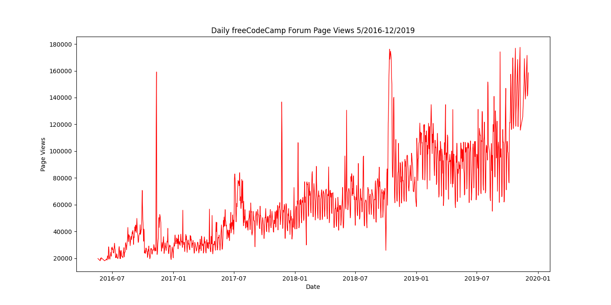
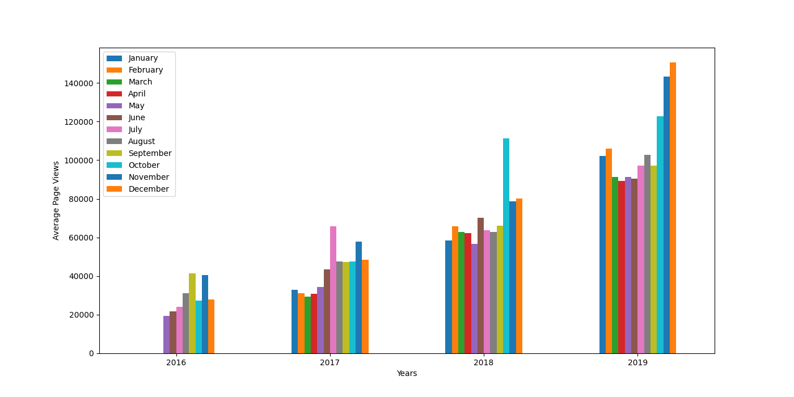
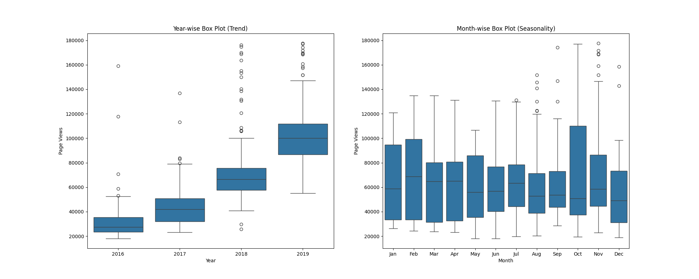

### Page View Time Series Visualizer

###### Technologies:
<p align="center">


</p>

### Try it!

To run the Page View Time Series Visualizer application, follow the instructions in the Setup section below.

## Project Structure

- `time_series_visualizer.py`: Contains the implementation of the time series visualization functions.
- `main.py`: Used for development and testing the functions.
- `test_module.py`: Contains unit tests for validating the implementation.

## Setup

### Prerequisites

- Python 3 installed
- Pandas installed
- Seaborn installed
- Matplotlib installed

### Installation Steps

1. Clone the repository:
   ```bash
   git clone https://github.com/creinis/pageview-sv-fcc-data-analyses-py-cert.git
   cd page-view-time-series-visualizer
   ```

2. Install the required libraries:
   ```bash
   pip install pandas seaborn matplotlib
   ```

3. Run the Page View Time Series Visualizer script:
   ```bash
   python3 main.py
   ```

## Page View Time Series Visualizer

### Functionality

The Page View Time Series Visualizer analyzes and visualizes time series data to explore trends and patterns in the number of page views on the freeCodeCamp.org forum. The dataset contains daily page view counts from 2016-05-09 to 2019-12-03.

### Functions

#### draw_line_plot Function

This function creates a line plot showing daily page views over time. The x-axis represents the date, and the y-axis represents the number of page views.

#### draw_bar_plot Function

This function creates a bar plot showing the average daily page views for each month, grouped by year. The x-axis represents the years, and the y-axis represents the average page views. The legend shows the month labels.

#### draw_box_plot Function

This function creates two box plots: one showing the distribution of page views within each year, and the other showing the distribution within each month. These plots help to visualize trends and seasonal patterns.

### Practical Use Case

This visualizer is useful for analyzing web traffic data, understanding trends over time, and identifying seasonal patterns in page views. It can help website administrators and analysts make data-driven decisions.

### Benefits

- **Time Series Analysis:** Provides clear visualizations of time series data to identify trends and patterns.
- **Data Cleaning:** Utilizes Pandas for efficient data cleaning and manipulation.
- **Versatile Visualization:** Uses Matplotlib and Seaborn to create informative and aesthetically pleasing charts.

## How to Use

1. Call the `draw_line_plot` function to generate the line plot.
2. Call the `draw_bar_plot` function to generate the bar plot.
3. Call the `draw_box_plot` function to generate the box plots.

### Example Usage

```python
import time_series_visualizer

# Generate and save the line plot
line_plot_fig = time_series_visualizer.draw_line_plot()

# Generate and save the bar plot
bar_plot_fig = time_series_visualizer.draw_bar_plot()

# Generate and save the box plots
box_plot_fig = time_series_visualizer.draw_box_plot()
```

### Example Output

**Line Plot:**



**Bar Plot:**



**Box Plot:**



### Additional Information

- **Dataset:** Contains daily page view counts from the freeCodeCamp.org forum.
- **Comprehensive Analysis:** Visualizes trends and seasonal patterns in page views for thorough analysis.

---
#### This is a FreeCodeCamp Challenge for Data Analysis with Python Projects Certification.
<p align="center">

</p>